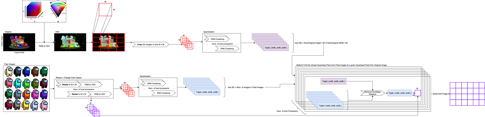

# picinpics
Script that receives an Image (original) and a set of images to be used as "pixels" in reconstruction of the Original image using the set of images as "pixels"

## Requirements

* Python 3.8
* Poetry
* Pyenv [OPTIONAL]

## Install

```shell
poetry install
```

## Usage

```shell
poetry run python main.py
```

Execution log:

```shell
2021-10-24 15:47:55.390 | DEBUG    | __main__:<module>:107 - to grid image read
2021-10-24 15:47:56.226 | INFO     | __main__:<module>:111 - reading files
100%|████████████████████████████████████████████████████████████████████████████████████████████████████████████████████████████████████████████████████████████████████████████████| 21/21 [00:00<00:00, 1081.52it/s]
2021-10-24 15:47:56.318 | INFO     | __main__:<module>:113 - 20 retrieved files
2021-10-24 15:47:56.319 | INFO     | __main__:<module>:115 - images normalizing
100%|█████████████████████████████████████████████████████████████████████████████████████████████████████████████████████████████████████████████████████████████████████████████████| 20/20 [00:00<00:00, 458.17it/s]
100%|█████████████████████████████████████████████████████████████████████████████████████████████████████████████████████████████████████████████████████████████████████████████████| 20/20 [00:00<00:00, 597.57it/s]
2021-10-24 15:47:56.399 | INFO     | __main__:<module>:119 - quantizing color
100%|█████████████████████████████████████████████████████████████████████████████████████████████████████████████████████████████████████████████████████████████████████████████████| 20/20 [00:00<00:00, 857.52it/s]
2021-10-24 15:47:56.425 | INFO     | __main__:<module>:122 - building grid
2021-10-24 15:47:56.431 | INFO     | __main__:build_grid:82 - quantizing to grid image
100%|████████████████████████████████████████████████████████████████████████████████████████████████████████████████████████████████████████████████████████████████████████████| 8160/8160 [00:06<00:00, 1257.16it/s]
2021-10-24 15:48:02.929 | INFO     | __main__:build_grid:85 - finding closests images
100%|█████████████████████████████████████████████████████████████████████████████████████████████████████████████████████████████████████████████████████████████████████████████| 8160/8160 [00:16<00:00, 500.46it/s]
2021-10-24 15:48:19.237 | INFO     | __main__:build_grid:92 - assemblying grid
2021-10-24 15:48:19.472 | INFO     | __main__:<module>:126 - done
```

> *To increase the output quality SUB_IMAGE_SIZE in code (W in image below), but will dramatically increase the processing time.

## Algorithm




## Improves

There is two major bottlenecks regarding processing:

1. Quantization

    > Receives an image as input and returns a single pixel 3D Tuple of UINT8

2. Match

    > Find the closest Quantized Pixel from Pixel Images to a given Quantized Pixel from Original Image
